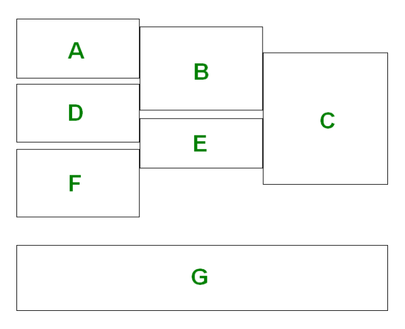
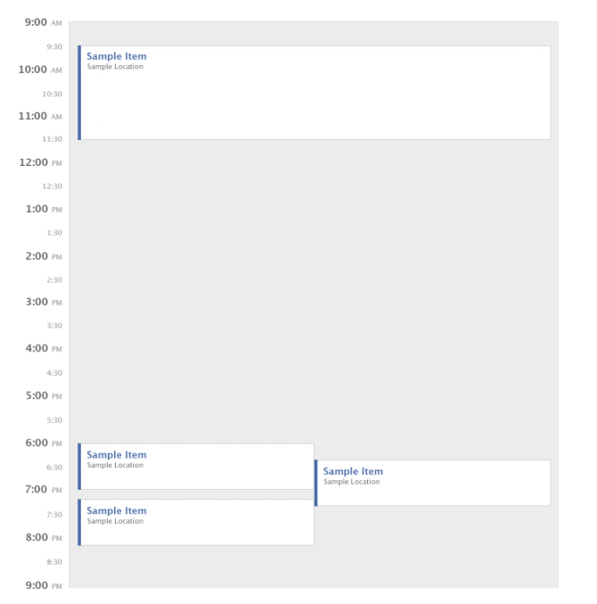

# Daily Calendar

<!-- ## Part 1

#### Write a javascript function to lay out a series of events on the calendar for a single day.

#### Events will be placed in a container. The top of the container represents 9am and the bottom represents 9pm.

#### The width of the container will be 600px and the height will be 720px (1 pixel for every minute between 9am and 9pm).

#### For example: 9am = 0; 10am=60; 1:20pm=260).<br>The objects should be laid out so that they do not visually overlap.

#### If there is only one event at a given time slot, its width should be 600px. There are 2 major constraints:).

- **Events should use the maximum width possible without overlapping.**
- **Every colliding event should be the same width as every other event that it
  collides with, while still adhering to the first constraint.**

### **_Events are in the following format:_**

```
[
{id : 1, start : 90, end : 130}, // an event from 10:30am to 11.10am
{id : 2, start : 105, end : 135}, // an event from 10:45am to 11:15am
{id : 3, start : 120, end : 240}, // an event from 11:00am to 1:00pm
{id : 4, start : 180, end : 260}, // an event from 12:00pm to 1:20pm
{id : 5, start : 500, end : 560} // an event from 5:20pm to 6:20pm
]
```

**This will be the function input.**

**Expected output from the function for the above input:**

```
[
{ id: 1, start: 90, end: 130, left: 0, width: 200},
{ id: 2, start: 105, end: 135, left: 200, width: 200},
{ id: 3, start: 120, end: 240, left: 400, width: 200},
{ id: 4, start: 180, end: 260, left: 0, width: 400},
{ id: 5, start: 500, end: 560, left: 0, width: 600}
]
```



---

## Part 2

#### Use your function from Part I to create a simple web page that is styled similarly to the below image:



#### with the same calendar events as given in the above example

### Notes

- **Please make sure that the code you write is clean and follows best practices - something you wouldn't mind putting in production.**
- **The app should be built using JavaScript/TypeScript, CSS/Sass/etc. and HTML and should run entirely in users’ browsers.**
- **You should send us back via email a zip file containing the entire code. Typically opening the index.html file in the browser should show the output, but if you have a different way to run it, please provide the instructions in a readme.md file.**

### FAQ

- **Are frameworks allowed? Sure, use what you are comfortable with, except for libraries that solve the exact same problem of placing events in a calendar.**
- **Is there a maximum bound on the number of events? You can assume a maximum of 100 events for rendering reasons, but your solution should be generalized.**
- **What browsers need to be supported? Chrome is enough.**
- **Does my solution need to match the image pixel for pixel? We expect your solution to be very similar to the image in terms of colors, proportions, paddings, and text, but we will not be testing for pixel matching** -->

---

# My solution 👨‍💻:

The solution starts with the `layOutDay` function and has two parts.

### Part 1 - setup the events:

At the beginning of the function, I call `getEventsWithAllTheirCollisions` function that receives events, and returns the events with each event will have an array `collisions` of all the events it collides with.

- **The Event Collision Testing:** <br> The check for collision is done by `eventsCollide` function, that comparing the start and end time of the events (event2 starts within event1 or event2 ends within event1).

After I get the events with all their collisions, I sort the event by start time, the first event is the earliest event.

### Part 2 - Now we're in the interesting part:

Calculate the width and location left of the event based on a collision count.

I'm running on the sorted array I created, and taking the first event I get (the earliest event).

1. **If the event has no collisions - it is set to left 0, and width 600.**

2. **If the event has collisions - the location is calculated according to the number of collisions. (left- 0, width- number of collisions).**

#### In case 2 - (has collisions):

- I'm running all the collision events of the current event, and updating their location as well.

- Defining the left location is done in the form of a counter, and the width is the same as the width of the current event.

- At the end I remove from the sorted array events the event Collision. (the event that was already defining).

#### Important 🙅‍♂️- Defining a location for an event is done once.

## My Daily Calendar look likes:


---

## Run The App

### Local use - 📌

- **Clone the repo - https://github.com/yakovcohen4/Outbrain-assignment.git**
- **Run `npm i` to install all the dependencies**
- **Run `npm start` on `react-app` directory.**

### Global use - 🌎

- **Test The App - 🔗 [Calender App]()**
