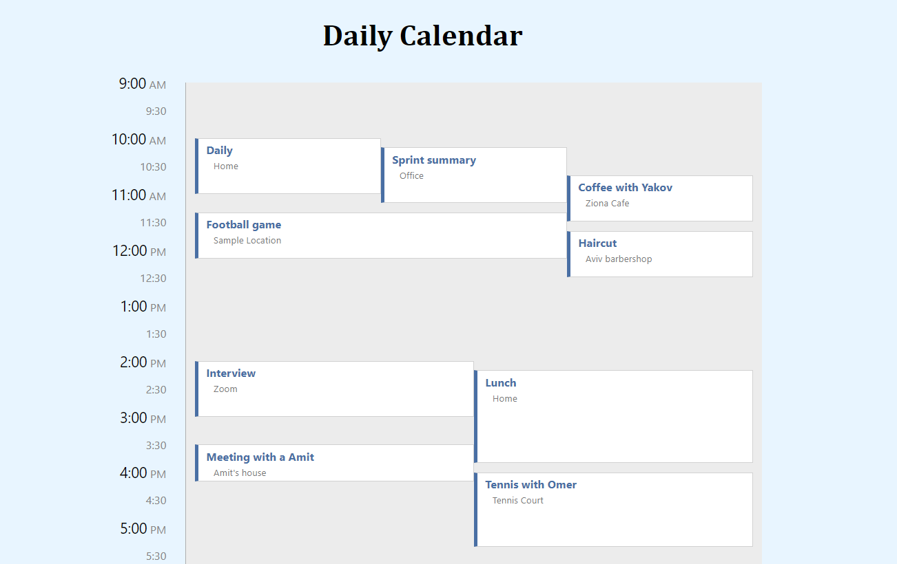

# Daily Calendar

### In this project, I create a daily calendar, that contains a list of events.

#### The Calendar display: width 600px ,height 720px.

#### The events are displayed with a title and a location. <br> Events use the maximum width possible without overlapping with other events.

#### The hours of the day are 9am to 9pm. <br> For example: 9am = 0, 10am=60, 1:20pm=260, etc. <br> - To change the hours, change the value of the variable `hourMap` in the `utils/hourMap.js` file.

### Example list of events:

```
[
{ id : 1, start : 90, end : 130 }, // an event from 10:30am to 11.10am
{ id : 2, start : 105, end : 135 }, // an event from 10:45am to 11:15am
{ id : 3, start : 120, end : 240 }, // an event from 11:00am to 1:00pm
{ id : 4, start : 180, end : 260 }, // an event from 12:00pm to 1:20pm
{ id : 5, start : 500, end : 560 } // an event from 5:20pm to 6:20pm
]
```

#### To change the events, change the value of the variable `events` in the `utils/events.js` file.

## My Daily Calendar look likes:



---

# My Code Explanation 👨‍💻:

The solution starts with the `layOutDay` function and has two parts.

### Part 1 - setup the events:

At the beginning of the function, I call `getEventsWithAllTheirCollisions` function that receives events, and returns the events with each event will have an array `collisions` of all the events it collides with.

- **The Event Collision Testing:** <br> The check for collision is done by `eventsCollide` function, that comparing the start and end time of the events (event2 starts within event1 or event2 ends within event1).

After I get the events with all their collisions, I sort the event by start time, the first event is the earliest event.

### Part 2 - Now we're in the interesting part:

Calculate the width and location left of the event based on a collision count.

I'm running on the sorted array I created, and taking the first event I get (the earliest event).

1. **If the event has no collisions - it is set to left 0, and width 600.**

2. **If the event has collisions - the location is calculated according to the number of collisions. (left- 0, width- number of collisions).**

#### In case 2 - (has collisions):

- I'm running all the collision events of the current event, and updating their location as well.

- Defining the left location is done in the form of a counter, and the width is the same as the width of the current event.

- At the end I remove from the sorted array events the event Collision. (the event that was already defining).

#### Important 🙅‍♂️- Defining a location for an event is done once.

---

## Run The App

### Local use - 📌

- **Clone the repo - https://github.com/yakovcohen4/Outbrain-assignment.git**
- **Run `npm i` to install all the dependencies**
- **Run `npm start` on `react-app` directory.**

### Global use - 🌎

- **Test The App - 🔗 [Calender App](https://yakovcohen4.github.io/Outbrain-assignment/)**
